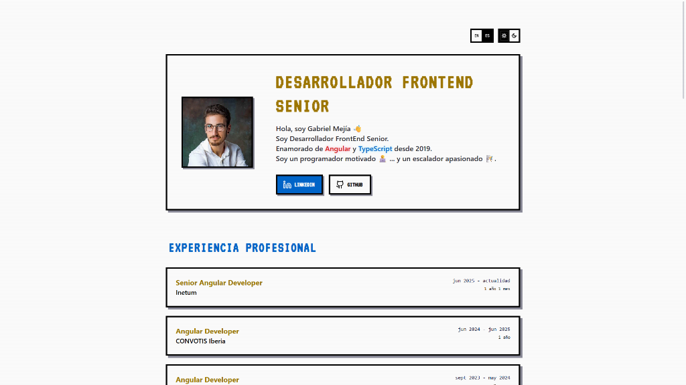
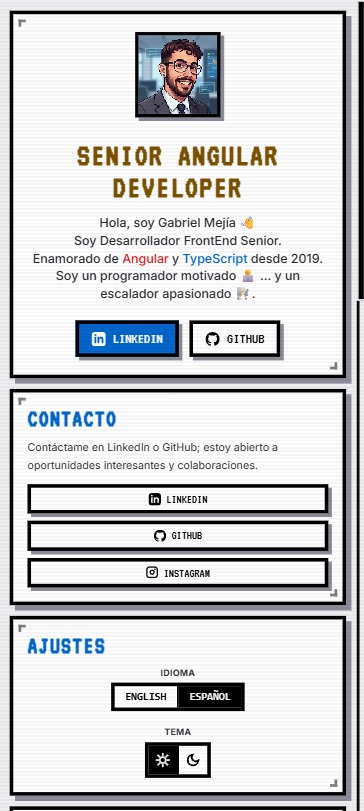

# 🎮 Retro Arcade Developer Portfolio - Angular 22, Zoneless & SSR

[](https://angular.dev)
[](https://www.typescriptlang.org/)
[](https://tailwindcss.com/)
[](https://gabri-mejia.vercel.app/home)

A high-performance, responsive, and SEO-friendly **Retro Arcade Developer Portfolio** template. Built from the ground up with the latest **Angular 22** technologies, featuring a retro 8-bit aesthetic, CRT screen filters, interactive Retro Windows mockups, and fully localized translations.

|                  🖥️ Desktop Preview                  |                 📱 Mobile Preview                  |
| :--------------------------------------------------: | :------------------------------------------------: |
|  |  |

With love, by Gabri Mejía ❤

🚀 **[Live DEMO / Live Preview](https://gabri-mejia.vercel.app/home)**

---

## 🌟 Visual Theme: Retro Arcade & CRT Aesthetic

This is not just another standard modern portfolio template. It stands out from the crowd with a **classic 80s/90s pixel arcade layout**:

- **CRT Scanlines Effect**: A realistic, non-intrusive CRT monitor scanline overlay and flicker effect.
- **Windows 98 Style Project Previews**: Interactive desktop windows where visitors can see live iframe previews, minimize, maximize, and interact with your projects directly in a retro-styled window wrapper.
- **Custom Font Overhaul**: Styled with the beautiful 80s arcade terminal font `'VT323'` and `'Pixelify Sans'` for that nostalgic feel.
- **Stepping Micro-Animations**: Interactive blocky cards that physically depress on hover and click, emulating physical 8-bit game cartridges and arcade buttons.

---

## 🚀 Key Technical Features

This project serves as a showcase of the latest and most modern frontend development practices:

- **Angular 22 Core**: Leveraging the absolute latest framework features including Signals, Standalone components, block control flow (`@if`, `@for`, `@defer`), and functional injectors (`inject()`).
- **Zoneless Change Detection**: Highly optimized rendering architecture using native Angular signals without the overhead of Zone.js.
- **Server-Side Rendering (SSR)**: Perfect lighthouse SEO and fast initial page loads, deploying seamlessly on modern cloud hosting.
- **Event Replay / Incremental Hydration**: Improved hydration performance for fast, interactive pages.
- **Tailwind CSS 4**: Modern styling utilizing the brand new Tailwind CSS 4 engine.
- **Multi-language Support (i18n)**: Fully localized in both English and Spanish with runtime language toggling.
- **ESLint & Prettier**: Configured linting and code formatting out-of-the-box.

---

## 🛠️ Getting Started

### Prerequisites

You need [Bun](https://bun.sh/) or [Node.js (v24.15.0 LTS or higher)](https://nodejs.org/) installed on your machine.

### Installation

1. **Clone the repository:**

   ```bash
   git clone https://github.com/endermejia/angular20-portfolio-ssr-zoneless.git
   cd angular20-portfolio-ssr-zoneless
   ```

2. **Install dependencies:**
   ```bash
   bun install
   # or
   npm install
   ```

### Development Server

To start a local development server, run:

```bash
bun start
# or
npm start
```

This will start the server with Hot Module Replacement (HMR) disabled, which allows `@defer` blocks to work properly with lazy loading.

If you prefer to use HMR (note that this will cause all `@defer` block dependencies to be loaded eagerly), you can run:

```bash
bun run start:hmr
# or
npm run start:hmr
```

Once the dev server is running, open your browser and navigate to `http://localhost:4200/`.

---

## 📦 Building and Running Production SSR

### Build the Project

To build the browser bundle and server bundle for Server-Side Rendering:

```bash
bun run build
# or
npm run build
```

This compiles your project and stores the build artifacts in the `dist/angular22` directory.

### Run Local SSR Server

To run the built SSR application locally:

```bash
bun run serve:ssr:angular22
# or
npm run serve:ssr:angular22
```

---

## 🚀 Deploying to Vercel

This project is fully configured for deployment on Vercel with Angular SSR.

1. Install the Vercel CLI or connect your GitHub repository directly to Vercel.
2. In the Vercel project configuration, select **Angular** as the framework preset.
3. The build command will automatically run `npm run build` and output the files correctly.
4. Ensure the output directory is configured as default for Angular SSR projects.

---

## ⚙️ How to Customize

You can customize this portfolio template to represent yourself in just a few minutes:

1. **Personal Information & Data**: Open `src/components/home/home.ts` and modify the signals containing your professional history, projects, and certifications.
2. **Translation Content**: Update translations in `public/i18n/en.json` (English) and `public/i18n/es.json` (Spanish) to customize the bio, roles, button texts, and tooltips.
3. **Avatars & Assets**: Replace images in the assets folder or link directly to your public image hosting inside the data declarations.

---

## 📜 Notes on Server-Side Rendering (SSR)

When running the application with SSR, you may see the following message in the console:

```
Not in browser environment, skipping map initialization
```

This is expected behavior. The map initialization is intentionally skipped during server-side rendering because map libraries like Leaflet require browser-specific APIs that are not available in the server environment. The map will be properly initialized when the application runs in the browser.

---

## ⭐ Show your support

If you like this retro arcade style template and want to support it, please give it a **Star**! it helps other developers find this project and inspires more templates.
